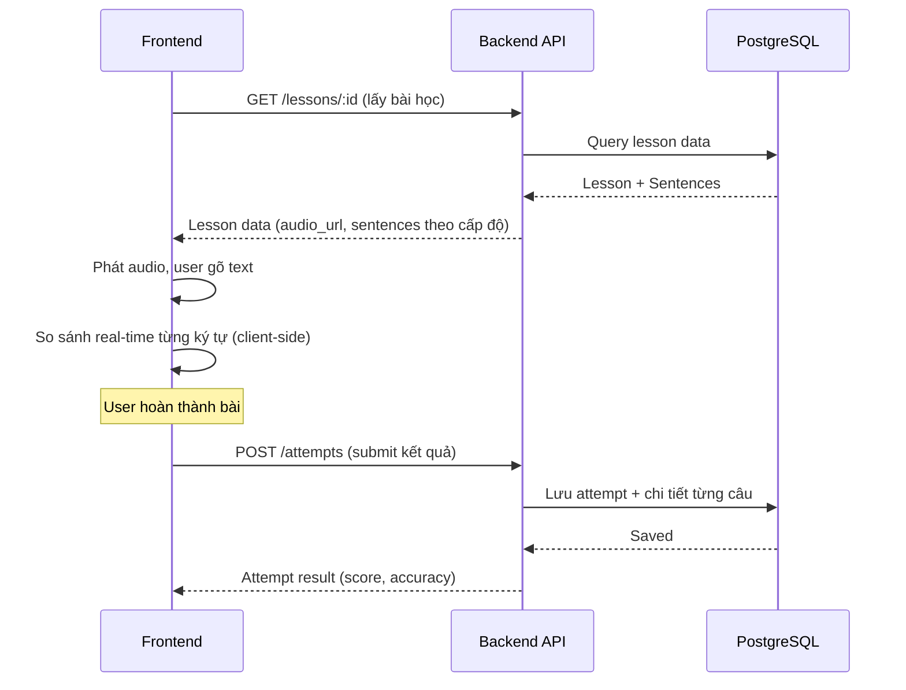
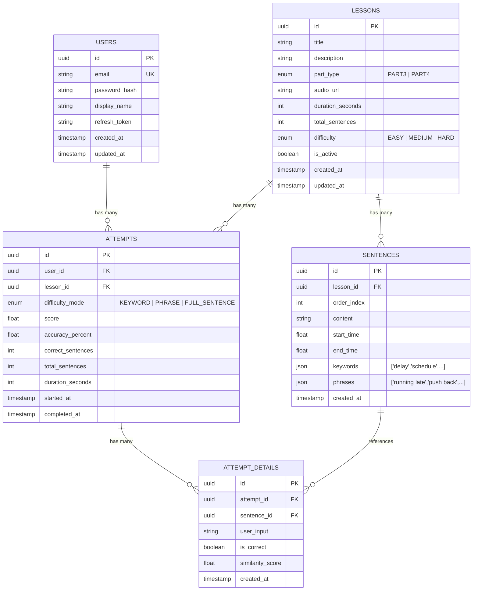

# PRD v2: Nền tảng Luyện nghe TOEIC - Chức năng Nghe Chép Chính Tả (Dictation)

> Phiên bản tập trung vào **MVP Phase 1**: Chỉ bao gồm chức năng cốt lõi **Nghe Chép Chính Tả** với phản hồi real-time.

---

## 1. Mục tiêu MVP Phase 1

Xây dựng luồng luyện nghe chép chính tả hoàn chỉnh từ đầu đến cuối:
1. Người dùng chọn bài nghe TOEIC (Part 3/4)
2. Chọn cấp độ khó (keyword / phrase / full sentence)
3. Nghe audio + gõ chép chính tả với phản hồi real-time (đúng/sai từng ký tự)
4. Xem kết quả sau khi hoàn thành bài

> [!NOTE]
> Các tính năng Gamification (Pet ảo, EXP), Vocab Vault, ASMR Typing Sound sẽ triển khai ở phase sau.

---

## 2. User Flow Chi Tiết

### 2.1 Luồng Xác thực (Authentication)
```
Guest → Đăng ký (Email/Password) → Đăng nhập → Nhận JWT Token → Truy cập hệ thống
```
- Sử dụng **JWT (Access Token + Refresh Token)**
- Access Token hết hạn sau 15 phút, Refresh Token hết hạn sau 7 ngày
- API public: danh sách bài học. API private: làm bài, xem kết quả

### 2.2 Luồng Chọn Bài Học (Lesson Selection)
```
Trang chủ → Danh sách bài học (phân trang, filter theo Part 3/4)
→ Click chọn bài → Xem thông tin bài (tên, thời lượng, độ khó, số câu)
→ Chọn cấp độ  → Bắt đầu làm bài
```

### 2.3 Luồng Chép Chính Tả (Core Dictation Flow)



#### Chi tiết logic so sánh (Client-side):
- **Keyword mode**: Chỉ hiện các ô trống tại từ khóa quan trọng, phần còn lại hiển thị sẵn
- **Phrase mode**: Ẩn các cụm từ, user phải gõ cụm từ
- **Full Sentence mode**: User gõ toàn bộ câu

#### Phản hồi real-time:
- Mỗi ký tự được so sánh ngay khi gõ
- ✅ Đúng → Hiển thị xanh lá
- ❌ Sai → Hiển thị đỏ + hiệu ứng rung nhẹ
- So sánh **case-insensitive**, bỏ qua dấu câu ở cuối

### 2.4 Luồng Xem Kết Quả (Result)
```
Hoàn thành bài → Hiển thị:
  - Tỷ lệ nghe đúng (%) 
  - Số câu đúng / tổng số câu
  - Chi tiết từng câu: transcript gốc vs câu user gõ (highlight sai)
  - Thời gian hoàn thành
```

---

## 3. Database Schema Chi Tiết

### 3.1 ERD Tổng quan



### 3.2 Chi Tiết Từng Bảng

#### Users
| Field | Type | Constraint | Mô tả |
|:---|:---|:---|:---|
| `id` | UUID | PK, auto-gen | ID người dùng |
| `email` | VARCHAR(255) | UNIQUE, NOT NULL | Email đăng nhập |
| `password_hash` | VARCHAR(255) | NOT NULL | Hash bcrypt |
| `display_name` | VARCHAR(100) | NOT NULL | Tên hiển thị |
| `refresh_token` | TEXT | NULLABLE | Refresh token hiện tại |
| `created_at` | TIMESTAMP | DEFAULT NOW() | Ngày tạo |
| `updated_at` | TIMESTAMP | DEFAULT NOW() | Ngày cập nhật |

#### Lessons
| Field | Type | Constraint | Mô tả |
|:---|:---|:---|:---|
| `id` | UUID | PK, auto-gen | ID bài học |
| `title` | VARCHAR(255) | NOT NULL | Tên bài ("Mission Alpha-01") |
| `description` | TEXT | NULLABLE | Mô tả ngắn / bối cảnh hội thoại |
| `part_type` | ENUM | NOT NULL | PART3 hoặc PART4 |
| `audio_url` | VARCHAR(500) | NOT NULL | URL file audio (S3 / Cloudflare R2) |
| `duration_seconds` | INT | NOT NULL | Thời lượng audio (giây) |
| `total_sentences` | INT | NOT NULL | Tổng số câu trong bài |
| `difficulty` | ENUM | DEFAULT 'MEDIUM' | Độ khó tổng thể của bài |
| `is_active` | BOOLEAN | DEFAULT true | Bài có đang hoạt động |
| `created_at` | TIMESTAMP | DEFAULT NOW() | |
| `updated_at` | TIMESTAMP | DEFAULT NOW() | |

#### Sentences
| Field | Type | Constraint | Mô tả |
|:---|:---|:---|:---|
| `id` | UUID | PK, auto-gen | ID câu |
| `lesson_id` | UUID | FK → Lessons, NOT NULL | Bài học chứa câu này |
| `order_index` | INT | NOT NULL | Thứ tự câu trong bài (0, 1, 2,...) |
| `content` | TEXT | NOT NULL | Nội dung transcript đầy đủ |
| `start_time` | FLOAT | NOT NULL | Giây bắt đầu câu trong audio |
| `end_time` | FLOAT | NOT NULL | Giây kết thúc câu |
| `keywords` | JSONB | DEFAULT '[]' | Mảng từ khóa cho Keyword mode |
| `phrases` | JSONB | DEFAULT '[]' | Mảng cụm từ cho Phrase mode |
| `created_at` | TIMESTAMP | DEFAULT NOW() | |

**Unique constraint**: (`lesson_id`, `order_index`)

#### Attempts (Lịch sử làm bài)
| Field | Type | Constraint | Mô tả |
|:---|:---|:---|:---|
| `id` | UUID | PK, auto-gen | |
| `user_id` | UUID | FK → Users, NOT NULL | |
| `lesson_id` | UUID | FK → Lessons, NOT NULL | |
| `difficulty_mode` | ENUM | NOT NULL | KEYWORD / PHRASE / FULL_SENTENCE |
| `score` | FLOAT | DEFAULT 0 | Điểm tổng |
| `accuracy_percent` | FLOAT | DEFAULT 0 | % nghe đúng |
| `correct_sentences` | INT | DEFAULT 0 | Số câu đúng |
| `total_sentences` | INT | NOT NULL | Tổng số câu |
| `duration_seconds` | INT | NULLABLE | Thời gian làm bài (giây) |
| `started_at` | TIMESTAMP | NOT NULL | |
| `completed_at` | TIMESTAMP | NULLABLE | |

**Index**: (`user_id`, `lesson_id`)

#### AttemptDetails (Chi tiết từng câu trong lần thử)
| Field | Type | Constraint | Mô tả |
|:---|:---|:---|:---|
| `id` | UUID | PK, auto-gen | |
| `attempt_id` | UUID | FK → Attempts, NOT NULL | |
| `sentence_id` | UUID | FK → Sentences, NOT NULL | |
| `user_input` | TEXT | NOT NULL | Nội dung user đã gõ |
| `is_correct` | BOOLEAN | DEFAULT false | Câu này có đúng không |
| `similarity_score` | FLOAT | DEFAULT 0 | Điểm tương đồng (0-1) |
| `created_at` | TIMESTAMP | DEFAULT NOW() | |

---

## 4. API Endpoints

### 4.1 Authentication
| Method | Endpoint | Auth | Mô tả |
|:---|:---|:---|:---|
| POST | `/api/auth/register` | ❌ | Đăng ký tài khoản |
| POST | `/api/auth/login` | ❌ | Đăng nhập, nhận tokens |
| POST | `/api/auth/refresh` | 🔑 Refresh | Làm mới access token |
| POST | `/api/auth/logout` | 🔑 Access | Đăng xuất, xóa refresh token |
| GET | `/api/auth/profile` | 🔑 Access | Lấy thông tin profile |

### 4.2 Lessons
| Method | Endpoint | Auth | Mô tả |
|:---|:---|:---|:---|
| GET | `/api/lessons` | ❌ | Danh sách bài học (phân trang, filter) |
| GET | `/api/lessons/:id` | 🔑 Access | Chi tiết bài học + sentences |
| POST | `/api/lessons` | 🔑 Admin | Tạo bài học mới (Admin) |
| PATCH | `/api/lessons/:id` | 🔑 Admin | Cập nhật bài học (Admin) |
| DELETE | `/api/lessons/:id` | 🔑 Admin | Xóa bài học (Admin) |

### 4.3 Dictation Attempts
| Method | Endpoint | Auth | Mô tả |
|:---|:---|:---|:---|
| POST | `/api/attempts` | 🔑 Access | Submit kết quả bài làm |
| GET | `/api/attempts` | 🔑 Access | Lịch sử làm bài của user |
| GET | `/api/attempts/:id` | 🔑 Access | Chi tiết một lần làm bài |

### 4.4 Query Parameters cho GET /api/lessons
```
?page=1
&limit=10
&part_type=PART3
&difficulty=EASY
&search=keyword
&sort_by=created_at
&sort_order=DESC
```

### 4.5 Request/Response Examples

#### POST /api/auth/register
```json
// Request
{
  "email": "user@example.com",
  "password": "SecureP@ss123",
  "display_name": "Nguyen Van A"
}

// Response 201
{
  "id": "uuid",
  "email": "user@example.com",
  "display_name": "Nguyen Van A",
  "created_at": "2026-03-25T14:00:00Z"
}
```

#### POST /api/auth/login
```json
// Request
{
  "email": "user@example.com",
  "password": "SecureP@ss123"
}

// Response 200
{
  "access_token": "eyJhb...",
  "refresh_token": "eyJhb...",
  "user": {
    "id": "uuid",
    "email": "user@example.com",
    "display_name": "Nguyen Van A"
  }
}
```

#### GET /api/lessons/:id
```json
// Response 200
{
  "id": "uuid",
  "title": "Mission Alpha-01: Office Meeting",
  "description": "A conversation about rescheduling a meeting",
  "part_type": "PART3",
  "audio_url": "https://storage.example.com/audio/lesson-01.mp3",
  "duration_seconds": 45,
  "total_sentences": 8,
  "difficulty": "MEDIUM",
  "sentences": [
    {
      "id": "uuid",
      "order_index": 0,
      "content": "Have you heard about the schedule change?",
      "start_time": 0.0,
      "end_time": 3.2,
      "keywords": ["heard", "schedule", "change"],
      "phrases": ["schedule change", "heard about"]
    }
  ]
}
```

#### POST /api/attempts
```json
// Request
{
  "lesson_id": "uuid",
  "difficulty_mode": "KEYWORD",
  "started_at": "2026-03-25T14:00:00Z",
  "completed_at": "2026-03-25T14:05:30Z",
  "details": [
    {
      "sentence_id": "uuid",
      "user_input": "Have you heard about the schedule change?"
    },
    {
      "sentence_id": "uuid",
      "user_input": "Yes, the meting was moved to Friday."
    }
  ]
}

// Response 201
{
  "id": "uuid",
  "score": 85.5,
  "accuracy_percent": 87.5,
  "correct_sentences": 7,
  "total_sentences": 8,
  "duration_seconds": 330,
  "details": [
    {
      "sentence_id": "uuid",
      "user_input": "Have you heard about the schedule change?",
      "original": "Have you heard about the schedule change?",
      "is_correct": true,
      "similarity_score": 1.0
    },
    {
      "sentence_id": "uuid",
      "user_input": "Yes, the meting was moved to Friday.",
      "original": "Yes, the meeting was moved to Friday.",
      "is_correct": false,
      "similarity_score": 0.95
    }
  ]
}
```

---

## 5. Business Logic Chi Tiết

### 5.1 Scoring Algorithm (Thuật toán chấm điểm)

```
Cho mỗi câu (sentence):
  1. Normalize: lowercase, trim, bỏ dấu câu cuối (.,!?)
  2. Tính similarity_score bằng Levenshtein Distance (0-1)
  3. is_correct = similarity_score >= THRESHOLD (default: 0.9)

Tính điểm tổng:
  accuracy_percent = (Σ similarity_score / total_sentences) * 100
  correct_sentences = count(is_correct == true)
  score = accuracy_percent (có thể thêm hệ số difficulty sau)
```

### 5.2 Difficulty Mode Logic
- **KEYWORD**: FE chỉ gửi user_input cho các từ khóa. BE so sánh từng keyword riêng lẻ
- **PHRASE**: FE gửi user_input cho các cụm từ. BE so sánh cụm từ
- **FULL_SENTENCE**: FE gửi toàn bộ câu. BE so sánh cả câu

### 5.3 Validation Rules
- Email: format email hợp lệ, unique
- Password: tối thiểu 8 ký tự, có chữ hoa + chữ thường + số
- Lesson title: 1-255 ký tự
- Audio URL: URL hợp lệ
- Sentences: phải có ít nhất 1 câu, start_time < end_time
- Attempt: lesson phải tồn tại và is_active, user phải authenticated

---

## 6. Non-functional Requirements

| Yêu cầu | Chi Tiết |
|:---|:---|
| **Authentication** | JWT (Access + Refresh Token), bcrypt hash password |
| **Validation** | class-validator + class-transformer ở DTO layer |
| **Error Handling** | Global exception filter, response format thống nhất |
| **Pagination** | Cursor-based hoặc offset-based cho danh sách |
| **API Docs** | Swagger/OpenAPI tự động generate |
| **Environment** | .env config cho DB, JWT secret, etc. |
| **Logging** | NestJS built-in logger |


###### Architecture của Backend trong plan này tuân theo cấu trúc **Modular Architecture** chuẩn của NestJS, kết hợp với các best practices để đảm bảo tính mở rộng và dễ bảo trì.

Dưới đây là các thành phần chính của kiến trúc:

### 1. Phân Lớp Kiến Trúc (Layered Architecture)
Mỗi module (Auth, Lessons, Attempts) sẽ được chia thành các lớp trách nhiệm riêng biệt:
- **Controller Layer**: Tiếp nhận HTTP requests, validate dữ liệu đầu vào (DTO) và trả về response.
- **Service Layer (Business Logic)**: Nơi xử lý logic nghiệp vụ chính (ví dụ: thuật toán tính điểm chép chính tả Levenshtein).
- **Data Access Layer (TypeORM Entities)**: Định nghĩa cấu trúc bảng và giao tiếp với PostgreSQL thông qua Repository pattern.

### 2. Tính Module Hóa (Modularity)
Project được chia thành các module độc lập:
- `AuthModule`: Xử lý đăng ký, đăng nhập, JWT.
- `UsersModule`: Quản lý thông tin người dùng.
- `LessonsModule`: Quản lý nội dung bài học và câu hỏi.
- `AttemptsModule`: Xử lý logic làm bài và lưu kết quả.
- `CommonModule`: Chứa các tiện ích dùng chung (filters, interceptors).

### 3. Cơ Chế Bảo Mật & Xác Thực
- **Guards & Strategies**: Sử dụng `Passport.js` với chiến lược **JWT Access & Refresh Token**.
- **Password Hashing**: Sử dụng `bcrypt` để mã hóa mật khẩu trước khi lưu vào DB.

### 4. Xử Lý Luồng Dữ Liệu (Request/Response Pipeline)
- **Validation Pipe**: Tự động validate dữ liệu đầu vào dựa trên các class Decorators trong DTO.
- **Global Exception Filter**: Đảm bảo mọi lỗi (404, 400, 500) đều trả về một format JSON đồng nhất.
- **Transform Interceptor**: Tự động chuẩn hóa format dữ liệu trả về (ví dụ bọc trong đối tượng `{ success: true, data: [...] }`).

### 5. Database (PostgreSQL)
- Sử dụng **TypeORM** để quản lý quan hệ giữa các bảng. Tận dụng kiểu dữ liệu `JSONB` của Postgres để lưu trữ linh hoạt các `keywords` và `phrases` trong từng câu hỏi mà không cần tạo quá nhiều bảng phụ.

### 6. Tài Liệu Hóa (API Documentation)
- **Swagger/OpenAPI**: Được tích hợp sẵn để tự động generate tài liệu API từ code, giúp bạn có thể test các endpoint ngay trên giao diện web tại `/api/docs`.

Kiến trúc này giúp bạn dễ dàng thêm các tính năng như **Pet ảo (Gamification)** hay **Vocab Vault** ở các phase sau bằng cách tạo thêm các module mới mà không ảnh hưởng đến code hiện tại.